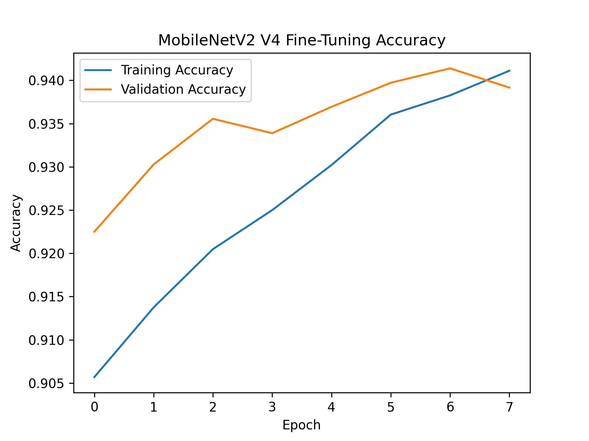
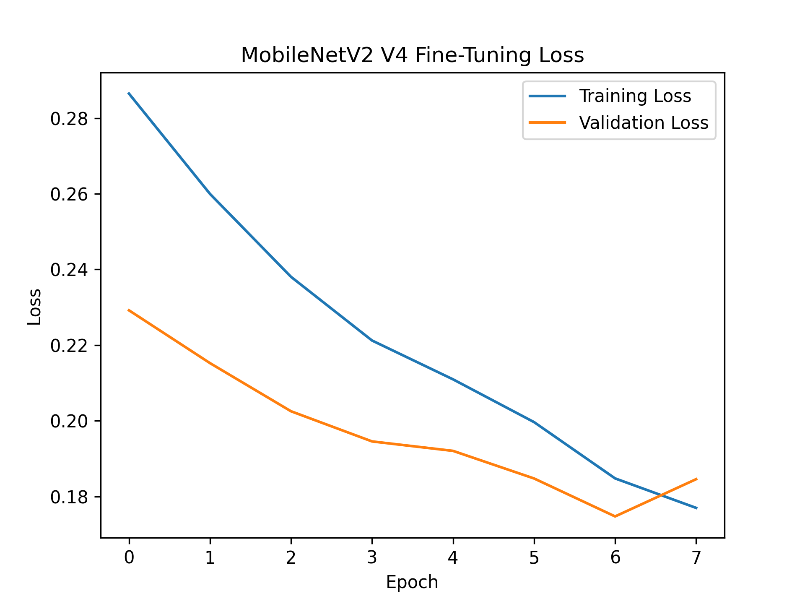
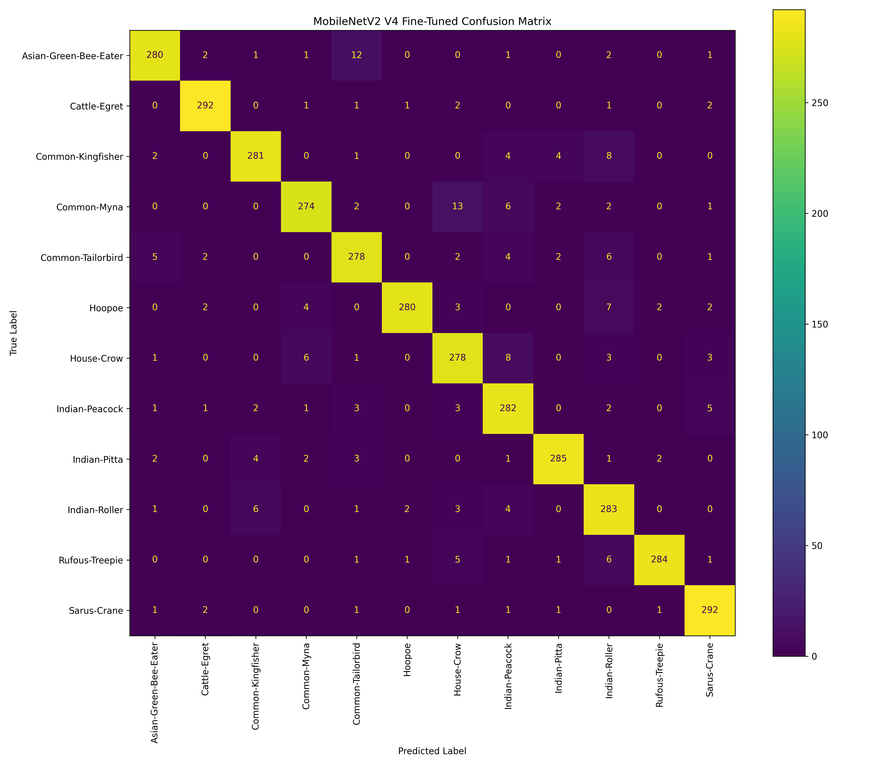

# AI-Based Bird Species Classification and Explainable Image Analysis

A deep learning-based bird image classification system that detects birds, classifies them into 12 supported Indian bird species, and provides visual explanations using Grad-CAM.

## Project Overview

The system follows a three-stage pipeline:

```text
Input Image
     ↓
Bird / Non-Bird Detection
     ↓
Bird Species Classification
     ↓
Top-3 Predictions
     ↓
Grad-CAM Explanation

### Species Classifier

| Model | Approach | Validation Accuracy |
|---|---|---:|
| V1 | Baseline CNN | 23.44% |
| V2 | Improved CNN | 77.00% |
| V3 | MobileNetV2 Transfer Learning | 92.00% |
| V4 | Fine-Tuned MobileNetV2 | 94.14% |

Final V4 metrics:

| Metric | Result |
|---|---:|
| Accuracy | 94.14% |
| Precision | 94.24% |
| Recall | 94.14% |
| F1 Score | 94.16% |
| Validation Loss | 0.1747 |

## Results

### Accuracy



### Loss



### Confusion Matrix



## Dataset

The final species classification dataset contains:

- 12 bird species
- 14,400 training images
- 3,600 validation images
- 1,200 training images per class
- 300 validation images per class

The dataset itself is not included in this repository because of its size.

## Technologies

- Python
- TensorFlow / Keras
- MobileNetV2
- Scikit-learn
- Pillow
- Matplotlib
- Streamlit
- CUDA
- cuDNN

## Running the Application

Clone the repository:

```bash
git clone https://github.com/kvaneesh23-code/bird-species-classification.git
cd bird-species-classification